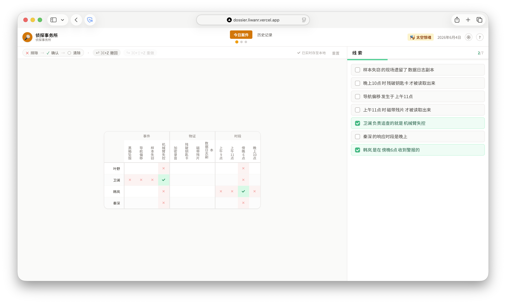

<div align="center">

# 🕵️ 侦探事务所 · Dossier

**每天一道逻辑推理谜题，化身侦探还原案件全貌。**

[](https://nextjs.org/)
[](https://react.dev/)
[](https://www.typescriptlang.org/)
[](https://tailwindcss.com/)
[](LICENSE)

</div>

<p align="center">
  <picture>
    
  </picture>
</p>

## 📖 项目介绍

「侦探事务所」是一个**逻辑推理网页游戏**。如果你玩过"**爱因斯坦的谜题**"（也叫斑马谜题 / Zebra Puzzle）——「英国人住红房子，瑞典人养狗，斑马是谁的？」——本游戏就是它的**侦探主题剧情版**。

每天提供 3 道不同难度的「逻辑网格」谜题（简单 / 中等 / 困难），玩家化身侦探，根据线索还原案件全貌：谁负责哪桩案件、用了哪件证物、案发于何时何地、嫌疑人是谁。

由 AC-3 约束传播算法保证每道题都有**唯一解**、**无需试错**；配有 **5 套主题包**（经典刑侦 / 古代刑名 / 校园悬案 / 海盗谜局 / 太空惊魂），每天按日期轮换，长期游玩不腻。

### ✨ 核心特性

- 🎲 **每日轮换**：每天 3 道题（4×4 简单、5×5 中等、6×6 困难），365 天不重样
- 🎭 **5 套主题包**：经典刑侦 · 古代刑名 · 校园悬案 · 海盗谜局 · 太空惊魂；同一天三档共享世界观
- 🧠 **算法保障**：AC-3 约束传播验证每道题都有唯一解、可由步步推理求得，绝不需要"试错猜测"
- 📅 **年度贡献图**：GitHub 风格的全年进度地图，记录每天战绩
- 🕒 **权威时间门控**：服务器统一以 Asia/Shanghai 时区计算"今天"，加 6 小时安全窗照顾海外玩家
- 🌗 **完整可访问性**：浅色 / 暗色 / 跟随系统三档主题，色盲安全调色板，高对比度模式
- 💾 **本地优先持久化**：进度自动保存到 IndexedDB，刷新不丢；带版本化迁移机制和多标签同步
- 📱 **响应式设计**：移动端 / 桌面端无缝切换，矩阵 / 线索视图一键互换

### 🌐 在线试玩

> **生产环境**：[https://detective-bureau.vercel.app](https://detective-bureau.vercel.app)（部署后填入实际地址）

部署在 [Vercel](https://vercel.com) + [Turso](https://turso.tech)（LibSQL）。

## 🎮 怎么玩

### 基本规则

右侧是若干**已知线索**，左侧是**逻辑网格**——每对类别（如侦探 × 案件）的交叉表格。

**目标**：推断每个格子是否成立，让每行每列恰好有一个"确认"。

### 操作

同一格子反复点击会循环切换状态：

| 操作 | 状态 | 含义 |
|:---:|:---:|---|
| 点一次 | ✕ | 排除该关系 |
| 再点一次 | ✓ | 确认该关系，系统自动排除同行同列其它格 |
| 再点一次 | ○ | 清除标记 |

### 线索类型

| 类型 | 例子 |
|:---:|:---|
| **直接正向** | 连环纵火案的现场发现了神秘纸条 |
| **直接负向** | 江宁没有前往地铁站台 |
| **时段范围** | 谢璟是在下午时段接到出警通知的 |
| **时序前后** | 珠宝失窃案的报案时间早于豪宅入室案 |

时段定义：**上午** 06:00-11:59 | **下午** 12:00-17:59 | **晚上** 18:00-23:59。正午 12 点归"下午"，傍晚 6 点归"晚上"。

### 辅助功能

- ⌨️ 撤回 / 重做：`Ctrl+Z` / `Ctrl+Y`（Mac 用 `⌘+Z` / `⌘+⇧+Z`）
- 🔁 重置：双击「重置」清空当前题（连带清当日同档及下游难度的战绩）
- 💾 自动保存：每次操作实时落盘 IndexedDB，跨标签自动同步
- 🎯 练习模式：在历史页选已完成的日期点「练习」，重新挑战且不影响今日战绩

### 解锁机制

- 简单 → 中等 → 困难 依次解锁
- 完成简单后**自动倒计时 8 秒**进入中等（可取消）
- 困难完成后显示「🎉 今日已完成全部案件」

## 🛠️ 技术栈

| 类别 | 技术 |
|:---:|---|
| **前端框架** | [Next.js 16](https://nextjs.org/) (App Router, Turbopack) |
| **UI** | [React 19](https://react.dev/) + [Tailwind CSS 4](https://tailwindcss.com/) |
| **状态管理** | [Zustand](https://zustand-demo.pmnd.rs/) |
| **本地存储** | [IndexedDB](https://developer.mozilla.org/zh-CN/docs/Web/API/IndexedDB_API)（通过 [idb](https://github.com/jakearchibald/idb)） |
| **数据库** | [Turso](https://turso.tech/) / [LibSQL](https://github.com/tursodatabase/libsql)（生产）；本地 SQLite（开发） |
| **生成算法** | AC-3 约束传播（[scripts/themes/](scripts/themes/)） |
| **类型系统** | [TypeScript 5](https://www.typescriptlang.org/) |
| **托管** | [Vercel](https://vercel.com/) |

### 项目结构

```
.
├── data/                       # 本地开发用 SQLite 题库
├── scripts/
│   ├── generate-puzzles.mjs    # 一年 1095 道题的批量生成器
│   ├── seed.mjs                # 把本地题库同步到 Turso
│   └── themes/                 # 5 套主题包（素材池 + 文案模板）
│       ├── classic.mjs
│       ├── ancient.mjs
│       ├── school.mjs
│       ├── pirate.mjs
│       ├── space.mjs
│       └── index.mjs
├── src/
│   ├── app/
│   │   ├── api/
│   │   │   ├── puzzle/[date]/   # 题目接口（带日期门控）
│   │   │   └── time/            # 权威时间接口
│   │   ├── history/             # 历史贡献图页
│   │   ├── layout.tsx
│   │   └── page.tsx             # 主游戏页
│   ├── components/
│   │   ├── game/                # 逻辑矩阵 / 线索面板 / 完成横幅
│   │   ├── history/             # 贡献图
│   │   ├── AppHeader.tsx
│   │   ├── SettingsModal.tsx
│   │   └── TutorialModal.tsx
│   ├── lib/
│   │   ├── db/                  # IndexedDB 持久化 + Turso 适配
│   │   ├── engine/              # 矩阵推理引擎（验证 / 提示 / 完成检测）
│   │   ├── hooks/
│   │   ├── store/               # Zustand stores
│   │   └── time/                # 服务器时区门控 + 会话日期锁定
│   └── types/
└── package.json
```

## 🚀 部署

### 本地开发

#### 1. 克隆并安装依赖

```bash
git clone https://github.com/<your-account>/detective-bureau.git
cd detective-bureau
npm install
```

#### 2. 生成题库（首次运行）

```bash
npm run generate
```

这一步会在 `data/puzzles.db`（本地 SQLite）里生成全年 1095 道题。无需联网，纯本地算法。

#### 3. 启动开发服务器

```bash
npm run dev
```

浏览器打开 [http://localhost:3000](http://localhost:3000) 即可。

### 部署到 Vercel + Turso

生产环境推荐用 Vercel 跑代码、Turso 跑数据库（都有免费额度）。

#### 1. 创建 Turso 数据库

```bash
# 安装 Turso CLI
curl -sSfL https://get.tur.so/install.sh | bash

# 登录并创建数据库
turso auth login
turso db create detective-bureau

# 拿到连接信息
turso db show detective-bureau --url       # → libsql://xxx.turso.io
turso db tokens create detective-bureau    # → 生成 auth token
```

#### 2. 把本地题库同步上去

```bash
# 在 .env.local 里写好两个变量（参见下一节）
TURSO_DATABASE_URL=libsql://xxx.turso.io \
TURSO_AUTH_TOKEN=eyJ...                  \
npm run seed
```

#### 3. Vercel 部署

把仓库 push 到 GitHub，然后在 Vercel：

1. **Import Project** → 选你的仓库
2. **Environment Variables**：
   - `TURSO_DATABASE_URL` = `libsql://xxx.turso.io`
   - `TURSO_AUTH_TOKEN` = `eyJ...`
   - `PUZZLE_MAX_DAYS_AHEAD`（可选，默认 1）= 服务器最多放出未来几天的题，防御纵深
3. **Deploy**

### 环境变量

| 变量 | 必填 | 说明 |
|---|:---:|---|
| `TURSO_DATABASE_URL` | 生产必填 | Turso 数据库连接 URL |
| `TURSO_AUTH_TOKEN` | 生产必填 | Turso 访问 token |
| `PUZZLE_MAX_DAYS_AHEAD` | ✗ | 服务器最多放出多少天后的题（默认 1）。即便时区算偏了，API 也最多放出 today + 1 天 |

> **不设这两个 Turso 变量时**会自动回落到本地 `local.db` SQLite，便于零配置开发。

## 🧪 开发与调试

### 常用命令

```bash
npm run dev        # 启动开发服务器（Turbopack）
npm run build      # 构建生产包
npm run start      # 启动生产服务器
npm run lint       # ESLint
npm run generate   # 生成题库
npm run seed       # 同步题库到 Turso
```

### 添加 / 修改主题包

1. 在 [scripts/themes/](scripts/themes/) 新建一个 `xxx.mjs`，参照 [classic.mjs](scripts/themes/classic.mjs) 的结构定义素材池、文案模板、标题
2. 在 [scripts/themes/index.mjs](scripts/themes/index.mjs) 的 `THEMES` 数组里 append（一定 append 不要 insert，否则历史日期对应的主题会偏移）
3. `npm run generate` 重新生成题库
4. `npm run seed` 同步到 Turso

### 算法不变式

- 生成器只接受 `ambiguousCount === 0` 的线索集，即**仅靠 AC-3 传播就能解到唯一**，玩家全程无需"假设 + 反推"
- 每题至少 2 种线索类型（多样性 tiebreaker）
- 涉及主类别（侦探 / 船长 / 宇航员 …）的模板每题至多 1 次，避免"X 名字 + 动作"重复

## 🤝 贡献

欢迎 Issue 和 PR。建议先开 Issue 描述需求 / 问题，再提 PR。

### 优先考虑的方向

- 新增主题包（提供 15 套素材 + 完整文案模板即可）
- 多语言支持（i18n）
- 跨设备同步（账号体系 / 云端历史）
- 分享成绩（Wordle 风格 emoji 网格）
- 排行榜 / 段位

## ⚖️ 开源协议

Dossier (侦探事务所) — A daily Einstein-style logic puzzle game, themed as detective mysteries with 5 rotating worlds.

Copyright (C) 2026 liWanr

This project is licensed under the GNU Affero General Public License v3.0 (AGPL-3.0).

If you modify and deploy this project as a network service, you must make the complete corresponding source code available under AGPL-3.0.

See the LICENSE file for details.

[AGPL-3.0 License](LICENSE)

<div align="center">

**Built with ❤️ for puzzle lovers.**

</div>
